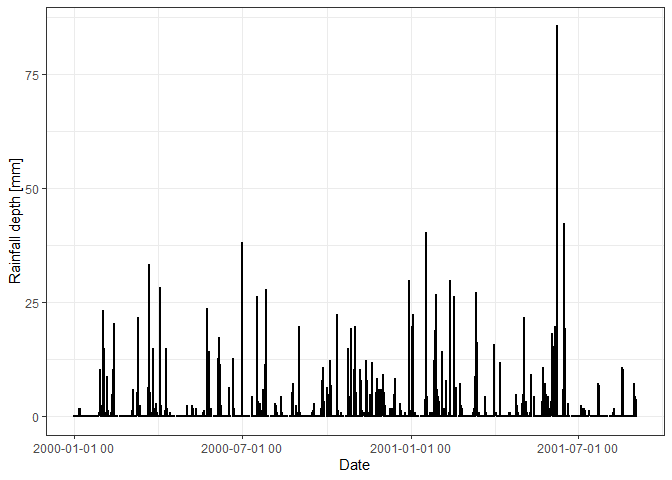
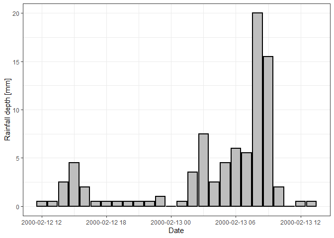
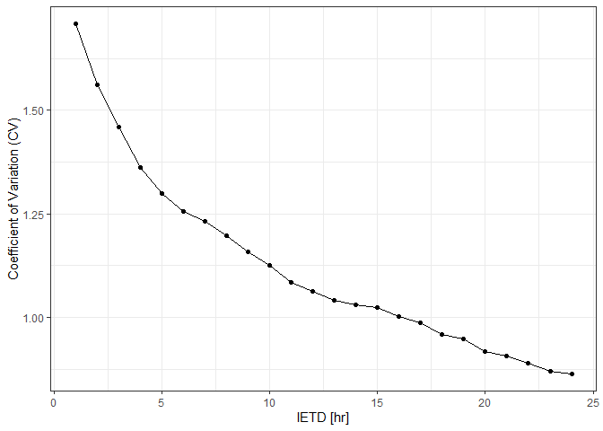

<!-- README.md is generated from README.Rmd. Please edit that file -->
IETD
====

<!-- badges: start -->
[](https://travis-ci.org/lfduquey/IETD) [](https://ci.appveyor.com/project/lfduquey/IETD) <!-- badges: end -->

The goal of IETD is to compute rainfall characteristics of independent rainfall events extracted from a sub-daily rainfall time series based on the inter-event time definition (IETD) method. To have a reference value of IETD, it also analyzes/computes IETD values through three methods: autocorrelation analysis, the average annual number of events analysis, and coefficient of variation analysis. Ideal to analyze the sensitivity of IETD to rainfall characteristics of independent rainfall events

Installation
------------

You can install the released version of IETD from [GitHub](https://github.com/) with:

``` r
# install.packages("devtools")
devtools::install_github("lfduquey/IETD")
```

Example
-------

These are two basic examples of two functions of IETD; the drawre and CVA functions.

The drawre function draws rainfall events from a sub-daily rainfall time series based on the inter-event time definition (IETD) method. The function allows slight rainfall events to be characterized which are in turn not considered in the extraction of rainfall events (a rainfall event whose rainfall pulses are lower than a threshold is characterized as a slight rainfall event). IETD is defined as the minimum dry or rainless period between two independent events.This time interval is applied to a continuous time series: if two groups of consecutive pulses of rainfall are separated by a rainless period longer than or equal to IETD, they are considered as two independent rainfall events; otherwise, these two groups are categorized as belonging to the same event. A rainless period between two independent events is known as inter-event time (b) and by definition b&gt;= IETD. The required inputs are a sub-daily rainfall time series, the value of IETD, and a rainfall depth threshold to define slight rainfall events (default value 0.5).The sub-daily rainfall time series must be in a dataframe; first column contains the time and day of the rainfall pulse and the second one the depth of rainfall in each time step. The date must be as POSIXct class.

The drawre function returns a list with a dataframe, named Rainfall\_Characteristics, and a sublist, named Rainfall\_Events. Rainfall\_Characteristics contains the main information of each extracted rainfall event such as the number of event, the beginning and end of the event, duration, volume, and average intensity. Rainfall\_Events contains several dataframes with the values of rainfall pulses of each extracted rainfall event. The first dataframe in Rainfall\_Events corresponds to the first event in Rainfall\_Characteristics, the second dataframe in Rainfall\_Events corresponds to the second event in Rainfall\_Characteristics and so on.

``` r
## Example of the use of drawre function
library(IETD)
library(ggplot2)
library(scales)
## load a time series (an artificial data that is included in the package) and plot it.
Time_series<-hourly_time_series 
ggplot(Time_series,aes(x=Date,y=Rainfall.depth)) + 
theme_bw()+
geom_bar(stat = 'identity',colour="black",lwd=1, fill="gray")+
scale_x_datetime(labels = date_format("%Y-%m-%d %H"))+
ylab("Rainfall depth [mm]")     
```



``` r

## Apply drawre function to Time_series to extract independent rainfall events by considering IETD=5 and a rainfall depth threshold of 0.5 to define slight rainfall events.
Rainfall.Eevents<-drawre(Time_series,IETD=5,Thres=0.5)$Rainfall_Events 

## Plot the extracted event # 13
Event13<-Rainfall.Eevents[[13]]
ggplot(Event13,aes(x=Date,y=Rainfall.depth)) + 
  theme_bw()+
  geom_bar(stat = 'identity',colour="black", lwd=1, fill="gray")+
  scale_x_datetime(labels = date_format("%Y-%m-%d %H"))+
  ylab("Rainfall depth [mm]")
```



The CVA function on the other hand computes the inter-event time definition (IETD) based on the coefficient of variation analysis. This method assumes b is represented well by an exponential distribution. Since b&gt;= IETD, IETD is computed as the value whose resulting coefficient of variation (CV) of b equal to unity.This analysis is done by testing several values of IETD and analyzing the resulting CV. The computed IETD is obtained via interpolation from the figure of IETD vs CV. The required inputs are a sub-daily rainfall time series and the maximum value of IETD to be analyzed (in hours). The sub-daily rainfall time series must be in a dataframe; first column contains the time and day of the rainfall pulse and the second one the depth of rainfall in each time step. The date must be as POSIXct class. The CVA function returns a list with a figure of IETD vs CV, a dataframe with the values of that figure, and the computed value of IETD.

``` r
## Example of the use of CVA function
Results_CVA<-CVA(Time_series=hourly_time_series,MaxIETD=24)
IETD_CVA<-Results_CVA$EITD
Results_CVA$Figure
```


